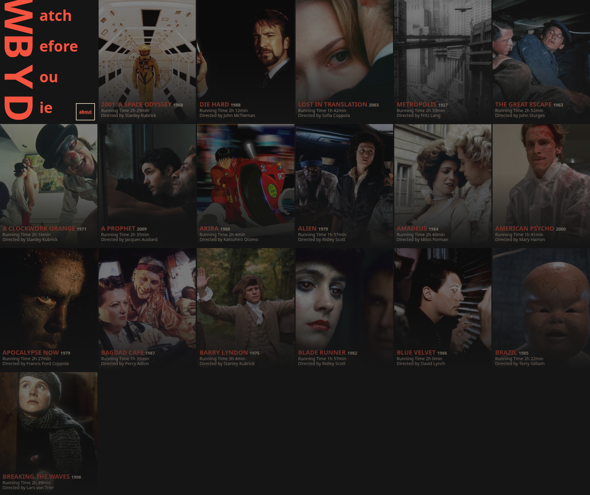

# Watch Before You Die

> _No good movie is too long and no bad movie is short enough - Roger Ebert._

A curated compilation of essential films to watch before you die.

**Live site:** [https://watchbeforeyoudie.com](https://watchbeforeyoudie.com)

<p align="center">
  <a href="https://watchbeforeyoudie.com/">
    
  </a>
</p>

## Table of Contents

- [About](#about)
- [Movie Submission](#movie-submission)
- [Contribution](#contribution)
- [Movie Candidates](#movie-candidates)
- [Tech Stack](#tech-stack)
- [Development](#development)
- [License](#license)

## About

This project showcases a carefully curated list of iconic and must-watch films from cinema history. Each movie is presented with its poster, year, runtime, and director information in a beautiful, responsive grid layout.

## Movie Submission

Have a movie that deserves to be on this list? Submissions are welcome!

- [Create an issue](https://github.com/ngermeau/watch_before_you_die/issues/new) to suggest a new movie
- Please include: movie title, year, director, and why it deserves to be on the list

## Contribution

Contributions are welcome! Whether it's bug fixes, feature requests, or improvements:

- Send a Pull Request
- [Create an issue](https://github.com/ngermeau/watch_before_you_die/issues/new)

## Movie Candidates

Movies being considered for addition to the collection:

- [ ] Being John Malkovich
- [ ] Eternal Sunshine of the Spotless Mind
- [ ] Alice in Wonderland
- [ ] Seven Samurai
- [ ] Stalker
- [ ] The Wizard of Oz
- [ ] The Umbrellas of Cherbourg
- [ ] The Wages of Fear (Le Salaire de la Peur)
- [ ] Persona
- [ ] 12 Angry Men
- [ ] Ikiru
- [ ] Dark City
- [ ] In the Name of the Father
- [ ] Children of Paradise
- [ ] Delicatessen
- [ ] Enter the Void
- [ ] The Elephant Man
- [ ] Incendies
- [ ] Barton Fink
- [ ] Stranger Than Paradise
- [ ] Burnt by the Sun
- [ ] No Man's Land
- [ ] El Topo
- [ ] The Royal Tenenbaums
- [ ] Mississippi Burning
- [ ] The Swimming Pool
- [ ] The White Ribbon (Le Ruban Blanc)
- [ ] Uncle Boonmee Who Can Recall His Past Lives
- [ ] Bamako
- [ ] Animal Kingdom
- [ ] The Truman Show
- [ ] The Pianist
- [ ] Life Is Beautiful (La Vita è Bella)
- [ ] Amen

## Tech Stack

- **Framework:** [SvelteKit](https://kit.svelte.dev/)
- **Styling:** [Tailwind CSS](https://tailwindcss.com/)
- **Language:** TypeScript
- **Build Tool:** Vite

## Development

### Prerequisites

- Node.js (v16 or higher)
- npm or pnpm

### Getting Started

```bash
# Install dependencies
npm install

# Start development server
npm run dev

# Build for production
npm run build

# Preview production build
npm run preview
```

## License

This project is open source and available under the [MIT License](LICENSE).

---

Made with ❤️ for cinema lovers everywhere