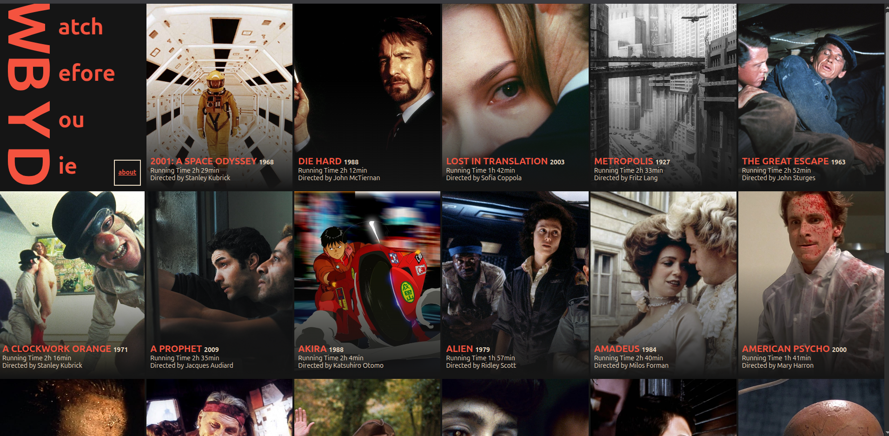

# Watch Before You Die

> _No good movie is too long and no bad movie is short enough - Roger Ebert._

A curated compilation of essential films to watch before you die.

**Live site:** [https://watchbeforeyoudie.com](https://watchbeforeyoudie.com)

<p align="center">
  <a href="https://watchbeforeyoudie.com/">
    
  </a>
</p>

## Table of Contents

- [About](#about)
- [Movie Candidates](#movie-candidates)

## About

This project showcases a carefully curated list of iconic and must-watch films from cinema history. Each movie is presented with its poster, year, runtime, and director information in a beautiful, responsive grid layout.

## Movie Candidates

Movies being considered for addition to the collection:

- [ ] Being John Malkovich
- [ ] Eternal Sunshine of the Spotless Mind
- [ ] Alice in Wonderland
- [ ] Seven Samurai
- [ ] Stalker
- [ ] The Wizard of Oz
- [ ] The Umbrellas of Cherbourg
- [ ] The Wages of Fear (Le Salaire de la Peur)
- [ ] Persona
- [ ] 12 Angry Men
- [ ] Ikiru
- [ ] Dark City
- [ ] In the Name of the Father
- [ ] Children of Paradise
- [ ] Delicatessen
- [ ] Enter the Void
- [ ] The Elephant Man
- [ ] Incendies
- [ ] Barton Fink
- [ ] Stranger Than Paradise
- [ ] Burnt by the Sun
- [ ] No Man's Land
- [ ] El Topo
- [ ] The Royal Tenenbaums
- [ ] Mississippi Burning
- [ ] The Swimming Pool
- [ ] The White Ribbon (Le Ruban Blanc)
- [ ] Uncle Boonmee Who Can Recall His Past Lives
- [ ] Bamako
- [ ] Animal Kingdom
- [ ] The Truman Show
- [ ] Life Is Beautiful (La Vita è Bella)
- [ ] Amen

### Getting Started

```bash
# Install dependencies
ng serve
```

## License

This project is open source and available under the [MIT License](LICENSE).

---

Made with ❤️ for cinema lovers everywhere
